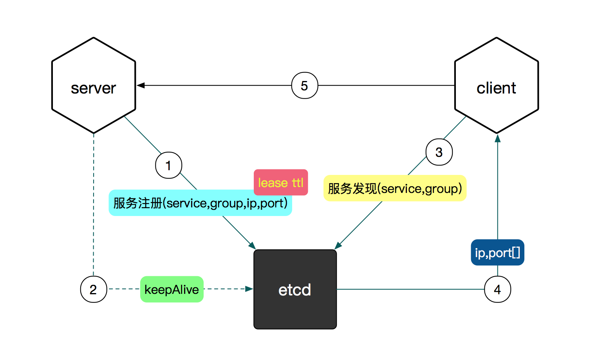

# precise-mesh

[](https://travis-ci.org/feuyeux/precise-mesh)
[](https://codecov.io/gh/feuyeux/precise-mesh)

1. Download etcd(3.2.17) from [pre-built](https://github.com/etcd-io/etcd/releases)
1. Run `etcd` and `etcdctl` :
    ```shell
    cd ~/garden/etcd
    ip=$(ifconfig -a|grep inet|grep -v 127.0.0.1|grep -v inet6|awk '{print $2}'|tr -d "addr:")
    ./etcd --listen-client-urls http://${ip}:2379 --advertise-client-urls http://${ip}:2379
    ```
    ```
    2018-09-26 14:23:58.333274 I | etcdmain: etcd Version: 3.3.9
    ...
    2018-09-26 14:23:58.586159 I | etcdserver/api: enabled capabilities for version 3.3
    ```

    ```shell
    cd ~/garden/etcd
    export ETCDCTL_API=3
    ip=$(ifconfig -a|grep inet|grep -v 127.0.0.1|grep -v inet6|awk '{print $2}'|tr -d "addr:")
    ./etcdctl --endpoints=http://${ip}:2379 put foo bar
    ```
    ```
    OK
    ```
    ```
    ./etcdctl --endpoints=http://${ip}:2379 get foo
    ```
    ```
    foo
    bar
    ```

### discovery


